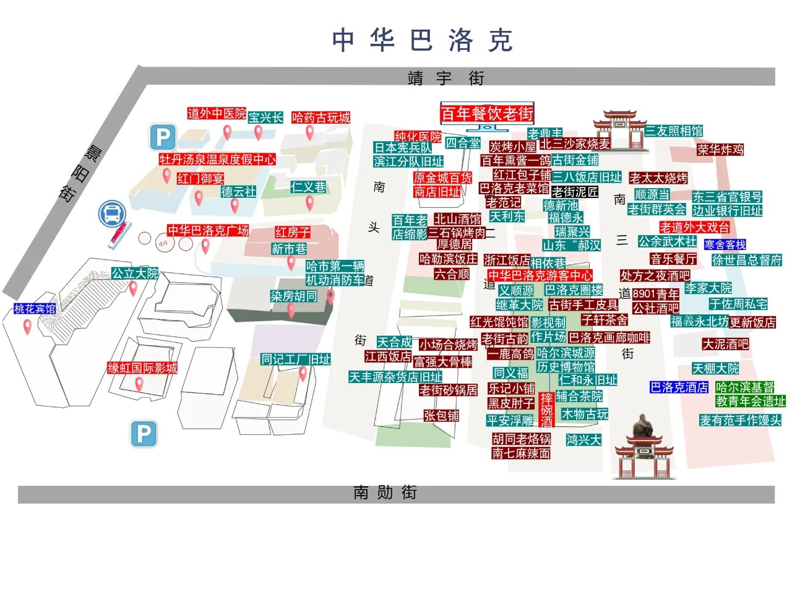

# 行程

[日历](https://calendar.google.com/calendar/u/0?cid=MzljYzA0NTUyYzgyM2E1ZTkxZTkwYWU4ZjJhM2Q0MWNlZmU5NWFjNTkxNDE0YWMwNTQzZDdmZGY4Yzg4OTQ4Y0Bncm91cC5jYWxlbmRhci5nb29nbGUuY29t)

## 08-07
当天到达，先去`哈药六厂`。

有时间可以去`哈尔滨工业大学`荡荡

晚餐，到`三河屯铁锅炖`

## 08-08
早上到`松花江索道`，坐索道去`太阳岛`。

逛到中午，去`中央大街`找到`波特曼西餐厅（道里店）`吃午饭。

吃完饭可以再去`松花江铁路大桥`看看。

然后看时间和想法，可选一下：
- 参加讲习班
- 继续逛街

下午主要是逛`索菲亚大教堂`、`巴洛克风情街`、`中央大街`。**步行**

晚饭可以去`张包铺（道外店）`，在`巴洛克风情街`。

吃完饭可以再去`松花江铁路大桥`看看日落。

## 08-09
上午起床，就去`731博物馆`。然后十一点往回走。

午饭挑选`老昌春饼（百盛店）`。

> 此部分行程动态调整

晚饭可以去参加晚宴，如果能进去的话。
进不去的话，再去`中央大街`玩

## 08-10
上午打车前往`哈尔滨伏尔加庄园`，看建筑。
- plan B: 去`东北虎林园`

午饭动态调整。

下午先回场馆，看看弄不弄海报啥的。

然后再去`冰雪大世界室内`。

晚饭待定。

## 08-11
see you lala ~

# 开销
## 北七早市
> 早饭~~~

## 哈药六厂
> 营业时间 09:00 - 16:00
> 门票免费

## 哈尔滨工业大学
> 刷身份证进
> 哈工大校园内可以坐校车（有游客专线）到航天馆（不用预约，带身份证）。

## 松花江索道
> 往返：96元，单程：58元
> 营业时间：8.30 - 19.00

## 太阳岛
> 营业时间：8.30 - 17.00
> 门票免费

## 中央大街
> 逛街吧

## 巴洛克风情街
> 逛街吧

## 松花江铁路大桥
> 适合去看日落

## 索菲亚大教堂
> 门票20块钱
> 不过不推荐

## 731博物馆
> 开馆时间：09:00-17:00
> 需要提取预约
> 提前2天预约

## 冰雪大世界梦幻冰雪馆
> 门票：268/人

## 哈尔滨伏尔加庄园
> 成人门票+往返车178元
> 只适合拍照！

## 东北虎林园
> 惊险车125元/人