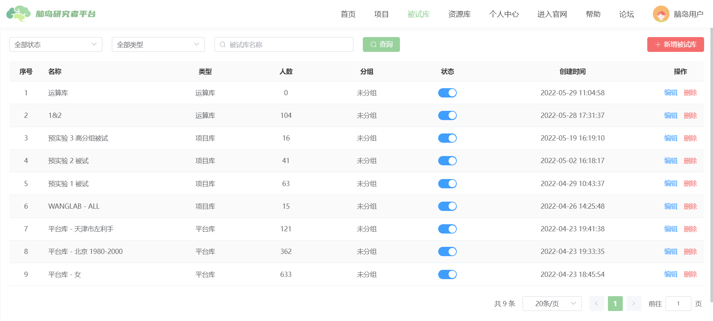

# 被试库

!> 被试库只能在发布于脑岛平台的项目中使用

被试库是用于控制[项目](researcher-manual/project.md)发布对象的一种手段。利用被试库，研究者可以有选择性地面向被试发布项目。
简单而言，被试库是在脑岛注册被试的一个个子集，研究者在发布项目时可以选择创建的被试库，从而实现面向特定被试人群发布项目。被试无法看到/作答未被指定的项目。
被试库可以包含固定的人群（静态库），也可以包含符合某个条件的所有被试（动态库）。灵活使用被试库，可以在脑岛平台内实现被试追踪等功能。

## 新增被试库
研究者可以以 3 种方式新增被试库

* 平台库

通过设置筛选条件（人口学信息）得到的符合条件的被试库。包含在库中筛选被试的数据来自于被试的个人中心——基本信息。

此类被试库属于动态库，平台所有符合筛选条件的被试都会包含在库中，如果新注册被试符合条件也会新增到库中，而如果被试修改了个人信息导致不符合条件则会从库中剔除。

.png)

* 项目库

通过导入被试可以创建包含固定被试的`静态`被试库。导入的来源包括

1. 从已完成的过往项目中导入参与过的被试
2. 通过被试 ID 列表导入

通过被试 ID 导入需要一份以`USERID`为表头的（见下方示例，注意大小写）Excel 文件 (xlsx)。被试 ID 可以`由项目（被试）库导出、过往项目的下载数据`中获得、被试在被试个人中心复制后`报告给研究者`等方式获得。

* 运算库

通过对 2 个`静态库`进行集合运算（交、并、补）生成一个新的被试库。

.png)

## 发布时选择被试库
当项目的发布渠道选择「脑岛平台」时，在发布对象设置中可以使用被试库指定发布对象。选定某个被试库之后可以包含该被试库或（从平台所有被试中）排除该被试库。通过这种方式可以圈定特定的被试范围。
未被选择的用户首页无法看见该项目，同时也无法作答（即使拿到链接）。

> 关于发布人数和被试库的关系
>
> 发布人数和被试库人数间并没有严格的要求，但通常`被试库的人数应当 ≥ 发布人数`。如果被试库人数不足，则项目无法收满人数，只能由研究者手动取消项目以终止。项目仍然发布费用按照`发布人数 X 单人报酬`计算。

.png)

## 管理被试库
可以在被试库列表对被试库进行修改和删除。但与正在发布的项目相关联的被试库无法修改和删除。