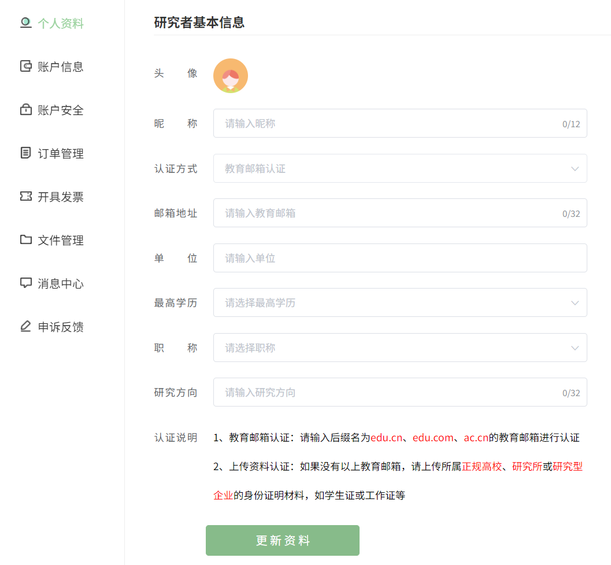
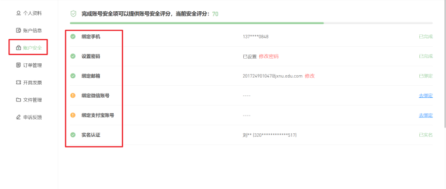
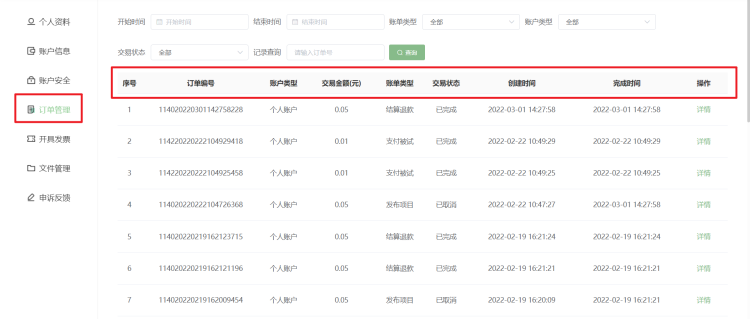
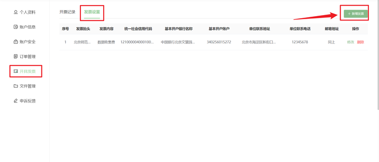
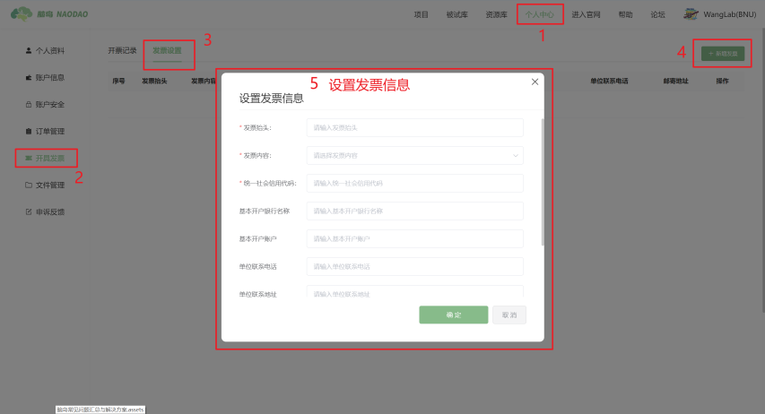
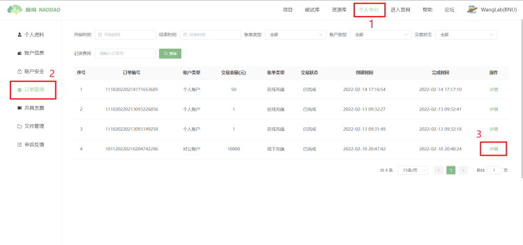
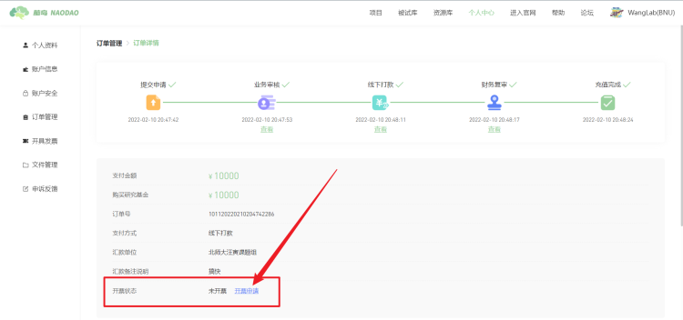
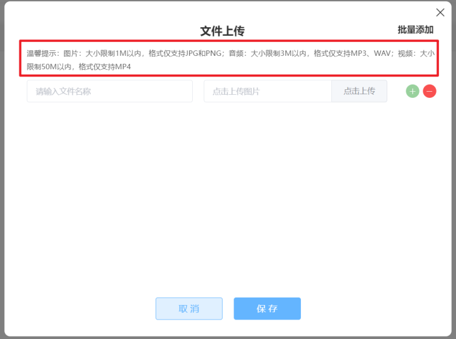
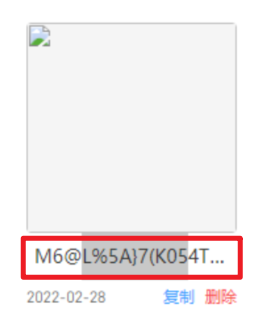
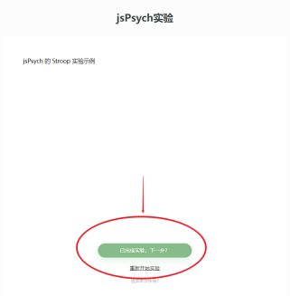

# 个人中心

当用户注册后，在进入研究者平台时脑岛会要求用户认证研究者。认证研究者需要在个人中心 - 个人资料完善资料，目前所有基本信息均为必填项。包括昵称、单位和研究方向等。认证可以选择使用教育邮箱或上传材料认证（人工审核稍慢）。

如果用户没有完善（认证）个人资料，则不能使用研究者平台所有功能，之后每一次进入研究者平台，脑岛都会默认先跳转到个人中心页面，提示用户完善个人资料。

> 认证方式一旦选择无法更改。上传材料认证时请上传能够识别身份的认证材料，上传封面或上传其他无关材料一般无法通过审核。

## 个人资料

研究者要正常使用平台必须完善个人资料并通过认证。用于认证研究者。其中最关键的认证，可选教育邮箱认证和上传资料

* 教育邮箱认证：请使用后缀名为 edu.cn、edu.com、ac.cn 的教育邮箱进行认证。系统会发送验证码至符合格式的邮箱，需要将验证码填回认证框
* 上传资料认证：如果没有以上教育邮箱可选上传资料（人工审核）。请上传所属正规高校、研究所或研究型企业的身份证明材料，如学生证或工作证等

> * 认证方式一旦选择无法更改
> * 如果没有收到验证码邮件请检查是否在「垃圾邮件」中，注意验证码的期限
> * 上传材料认证时请上传能够识别身份的认证材料，上传封面或上传其他无关材料一般无法通过审核

## 账户信息 <!-- {docsify-ignore} -->

?> [充值与报销](recharge.md)

## 账户安全

用户可在账户安全中进行绑定 / 修改 / 解绑手机号、邮箱以及微信账号和支付宝账号等操作。

## 订单管理

用户可在订单管理版块中查询所有的充值订单详情。

## 开具发票

若用户想要在脑岛平台开发票，请先在开具发票-发票设置-新增发票中设置发票信息：

设置好发票信息后，您可以在研究者平台-个人中心-订单管理中点击您想要开票的订单详情，然后在详情页面中点击【开票申请】按钮即可开票。

## 文件管理

用户可在文件管理版块中上传图片、音频和视频等材料。需要注意的是，上传材料的质量不应该超过相应的限制。上传的材料可以在简单云中实验中使用。

> 【脑岛Tips】上传材料的文件名请不要包含特殊字符：
> 

## 申诉反馈

当研究者在平台发布的项目中拒绝了被试，有可能收到被试的申诉。这种情况通常是被试认为其遭到了不正当的待遇。此时研究者可以尝试联系被试并沟通，查找是哪个环节出现了问题。

沟通完成之后可以在此处处理申诉。

## 常见问题

* 被试声称完成了实验，但记录中显示放弃
    这种情况很可能是被试没有进行最终的提交。

一个提交页面 be like:

提交成功页面 be like:

脑岛的一个项目可以承载多个不同类型的节点，因此每完成一个节点（问卷或实验）需要手动点击下一步以进入下一个节点或结束项目。有些被试可能看到实验结束的界面就直接关闭浏览器，没有进行最后的提交，因此数据不会被记录。研究者应该在项目（尤其是只有单个实验节点的项目）的指导语中提醒被试。