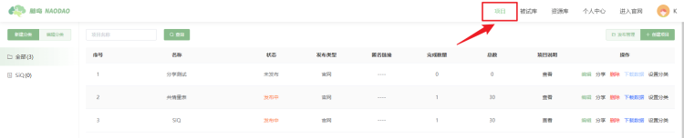
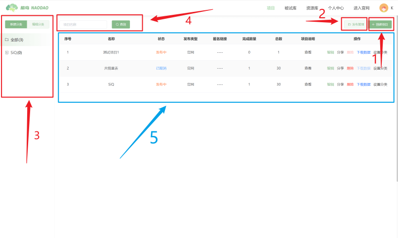
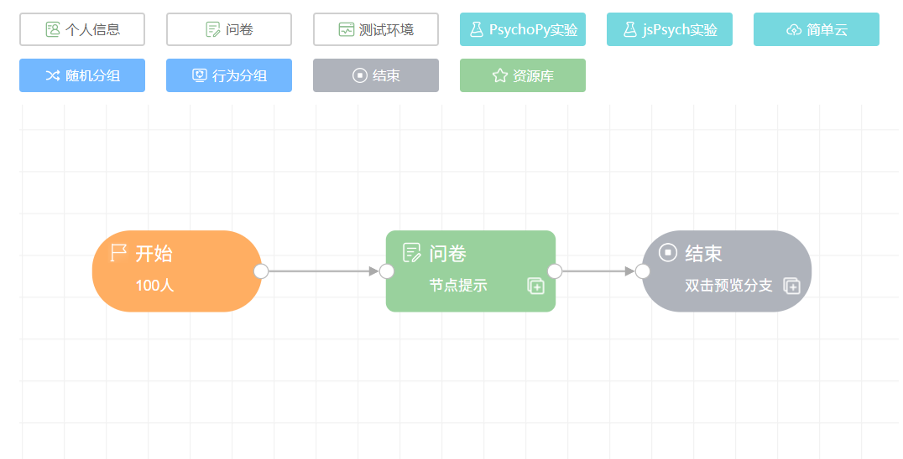
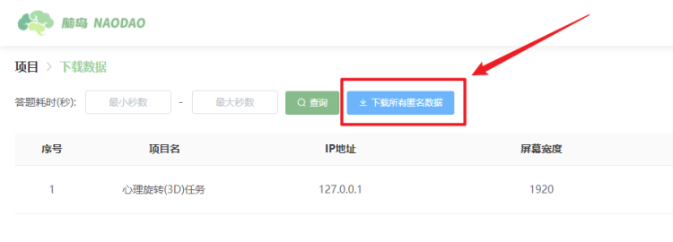

# 项目

在脑岛平台，研究者的研究都是通过项目承载的。研究的具体内容，例如问卷、实验等，都包含在项目中。项目是由研究者编辑、发布；由被试者作答、获得报酬等。

用户可点击导航栏上的【项目】按钮进入项目版块。项目版块的初始页面如下：

用户可以在【项目】页面进行以下操作：

1. 【创建项目】：用户可以通过此功能新建研究项目并进行编辑发布。
2. 【项目发布管理】：用户可以通过此功能对已发布或未发布的研究项目进行二次编辑和重新发布。
3. 【新建/编辑项目分类】：用户可以通过此功能将研究项目分类存放，以便于之后更好地管理。
4. 【查询项目】：用户可通过输入项目的名称来检索特定的项目。
5. 【项目看板】：用户可以在项目页面的中心看板区域总览自己所有的项目。

## 从零开始创建项目

一个脑岛的项目包括了如下要素：

### 项目信息

项目本身的一些属性，包括项目名称、项目描述、项目人数等。

### 项目内容

在一个项目中，[画布和节点](#画布和节点) 是项目的核心内容。每一种节点承载了对应的功能或内容，例如实验、问卷等；而画布用于排列、组织节点。通过在画布上连接各种节点，研究者可以实现灵活地编排研究内容。

## 项目发布管理

完成项目的编辑之后可以进行 项目的发布。发布就是将项目分发给被试（测试者）的过程。

脑岛提供了 2 种发布渠道：平台发布和匿名发布。

* 平台发布会将项目发布在脑岛平台首页 (https://www.naodao.com)。研究者通过脑岛发放被试费用，并可以利用脑岛提供的 被试库 等功能，对接收人群进行更精确的选择
* 匿名发布后脑岛仅提供一个匿名链接，研究者需要自行将链接分发给被试。脑岛平台不参与匿名发布项目的分发、信息收集、测试费结算等环节

无论选择哪种发布渠道，被试完成项目产生的数据都会储存在脑岛。

## 项目管理

## 项目数据管理

您可以点击【下载数据】按钮进入项目数据下载页面。

### 脑岛平台（答题赚钱）类型发布

#### 待审核版块

#### 已审核版块

### 匿名发布

脑岛默认采纳所有的匿名数据，不需要您自行采纳。因此匿名数据的【下载数据】页面李没有待审核和已审核版块。

对于一个匿名项目，脑岛默认每次下载所有的匿名数据，暂不支持下载选中数据。

