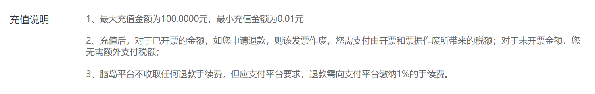
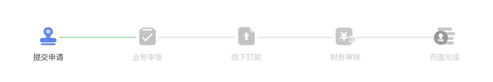
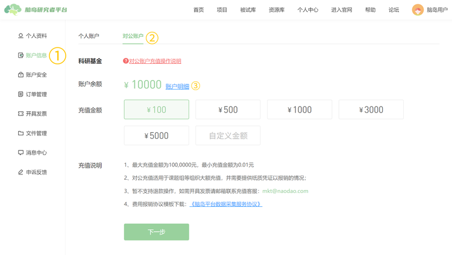
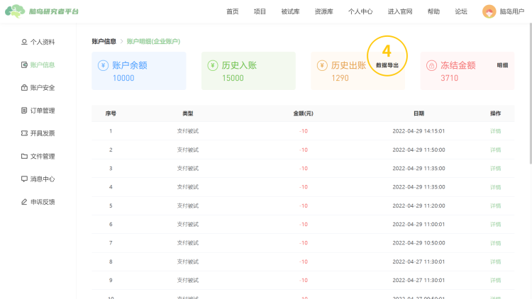

### 充值与退款

研究者在其个人中心——账户信息能够查看当前账户余额及进行充值操作。余额目前仅用于支付被试费。账户余额又分为个人账户和对公账户，2 个账户余额不能混用。

#### 个人账户充值

#### 对公账户充值

对公充值适用于课题组等组织的大额充值，即通过银行账户转账，并需要提供纸质凭证以报销的情况。对公充值不支持直接退款操作，如需退款请邮箱联系充值客服[mkt@naodao.com](mailto:mkt@naodao.com)。

对公充值需要经历以下 5 个步骤:

1. 充值方提交充值申请，留下账号和联系方式，等待平台审核
2. 平台方收到申请后会与您联系并核实充值信息，双方沟通成立后平台通过审核
3. 充值方向指定平台账户汇款，并在线上确认已汇款（上传银行转账的回执单）
4. 平台方核实是否汇款到账，经财务确认到账后则通过审核
5. 充值金额会进入研究者账户的「个人中心 — 账户信息 — 对公账户」中

### 报销事宜

#### 开具发票

在研究者个人中心——开具发票内，研究者可以选择为充值成功的订单开具增值税普通发票。在「发票设置」栏可以添加常用开票信息。

> 开具发票的金额是按照充值订单开具的，无关余额是否使用。

#### 数据采集协议（合同）

对于研究者需要平台方提供被试费证明协议材料（或合同）以供报销的，可以下载 进行填写，然后联系充值客服邮箱[mkt@naodao.com](mailto:mkt@naodao.com)进行后续步骤。

> 数据采集协议仅支持对公充值流程的研究者填写

#### 被试费详情

对于研究者需要每一笔被试费的订单详情的，可以通过如下步骤获取

1. 进入个人中心——账户信息——对公账户——账户明细

2. 选择历史出账的数据导出，并根据时间或项目筛选订单

