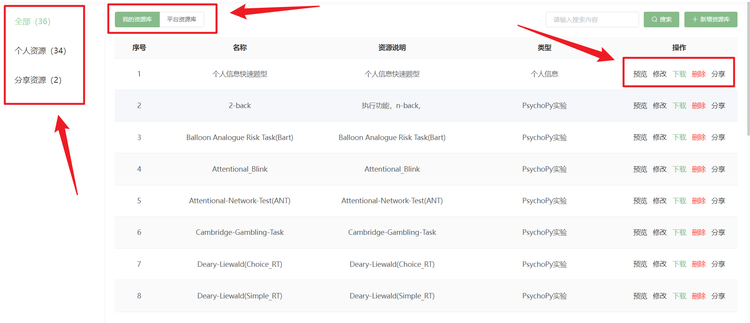
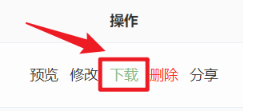

# 资源库
用户可点击**资源库**按钮进入脑岛的资源库页面。

脑岛资源库分为【我的资源库】和【平台资源库】，同时在每个资源库中还分为个人资源和分享资源两个版块。

在画布中被分享到【个人资源库】的节点将保存在【我的资源库】-【分享资源】版块中，被分享给【指定研究员】的节点将保存在指定研究员的【我的资源库】-【分享资源】中。
在【我的资源库】中点击【新增资源库】按钮直接添加的资源会保存在【我的资源库】-【个人资源】中。

在画布中被分享到【平台资源库】的节点将保存在【平台资源库】-【个人资源】版块中。同样，在【平台资源库】中点击【新增资源库】按钮直接添加的资源也会保存在【平台资源库】-【个人资源】中。而【平台资源库】-【分享资源】则保存的是其他研究者分享到【平台资源库】的资源。

## 资源预览

用户可以点击操作栏中的预览按钮对资源库中分享的节点进行预览。

### 预览个人信息、问卷、测试环境节点

### 预览PsychoPy实验节点和jsPsych实验节点

## 资源修改
用户可以点击【修改】按钮对自己上传或分享的节点进行修改。

## 资源下载
资源库中分享的节点均支持下载，用户可以点击操作栏中的下载按钮进行下载。

需要说明的是，个人信息、问卷、测试环境节点目前仅支持以txt文件格式下载。对于PsychoPy实验节点和jsPsych实验节点，将下载相应的实验压缩包(ZIP格式)。简单云实验节点目前暂不支持下载。

## 资源删除
用户可以点击【删除】按钮对自己上传或分享的节点进行删除。

## 资源分享
用户可以点击【分享】按钮将【我的资源库】中的资源分享到【平台资源库】或指定用户。

