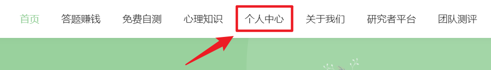
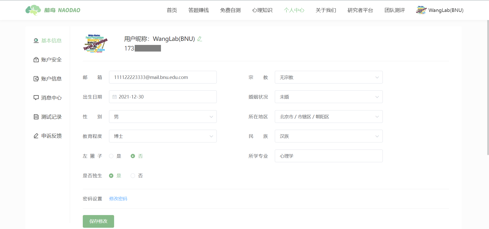
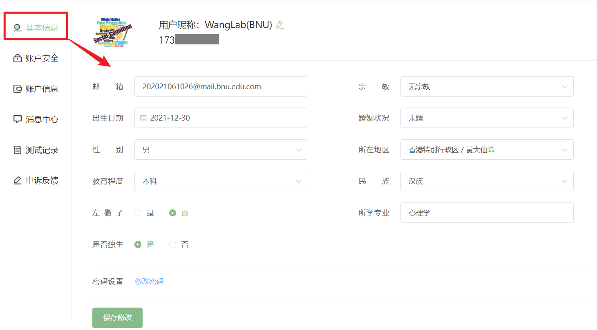
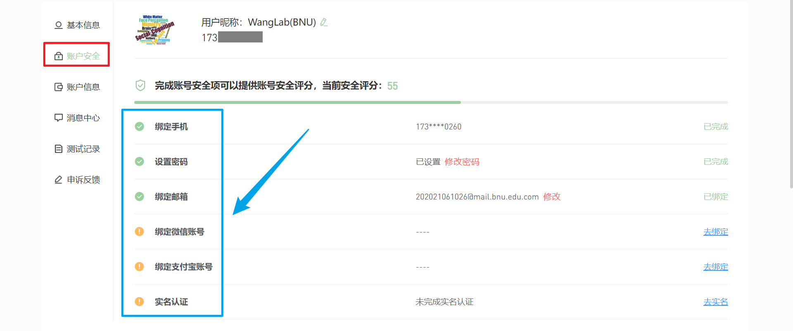
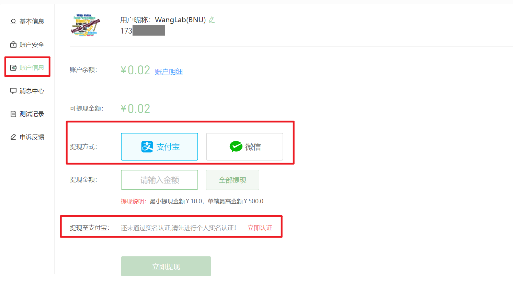
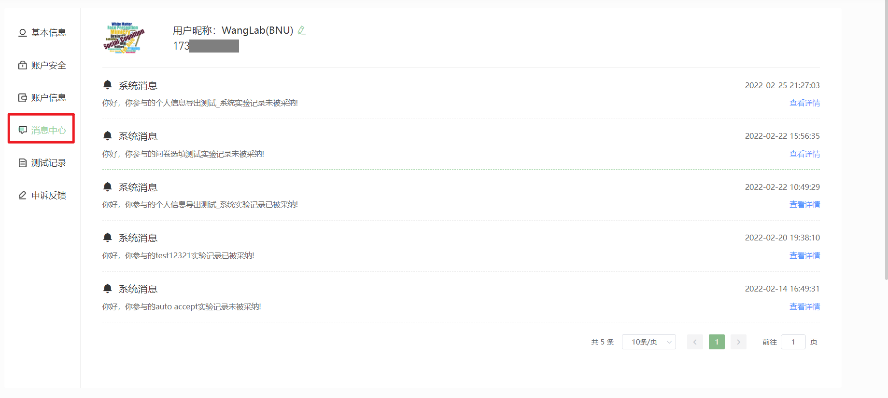
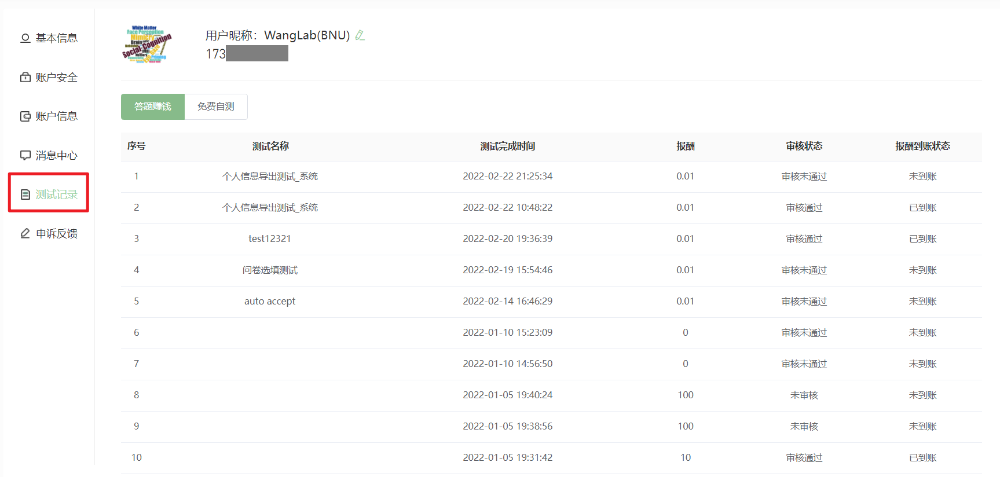
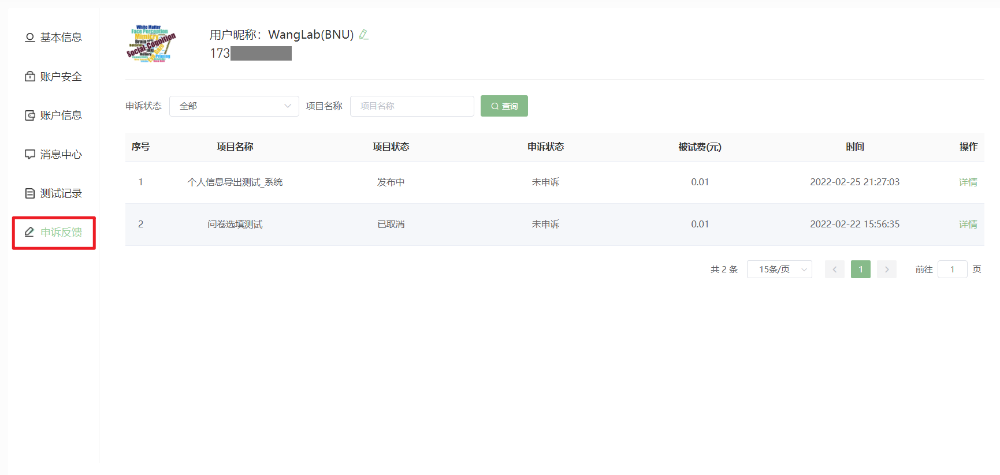

# 个人中心 <!-- {docsify-ignore-all} -->

## 基本信息
您可以在【基本信息】版块填写您的邮箱、出生日期、性别等个人信息，脑岛将会对您的个人信息严格保密。

## 账户安全

为了提升您的账户安全，脑岛建议您在【账户安全】版块完善您的账号信息，包括绑定您的微信和支付宝账号，以及实名认证，脑岛会对您的私密信息严格保密。

> 【脑岛Tips】脑岛强烈建议您进行实名认证，脑岛会对您的身份信息进行严格保密。用户若不进行实名认证，则无法使用脑岛论坛等一系列功能。

?> 【脑岛Tips】绑定支付宝和微信是否会存在风险？
>
> 先说结论：没有风险。
>
> 理由：微信和支付宝没有提供获取用户敏感信息的开放API，这些敏感信息包含：支付宝账号、真实姓名、银行卡信息等，因此脑岛不仅不会去收集用户的这些信息也无法收集到这些信息，脑岛仅仅是收集用户微信和支付宝的昵称和头像信息。

## 账户信息
您可以在【账户信息】版块中查看您的账户余额以及提现方式等。脑岛平台最小提现金额为10元，单笔提现最高金额为500元。需要注意的是，您必须通过实名认证后才能进行提现。

> 【脑岛Tips】脑岛暂不支持提现到微信，目前只支持提现到支付宝。

## 消息中心
您可以在【消息中心】查看您作为被试参与的每个项目的实验记录是否被项目发布者所采纳。

## 测试记录
您可以在【测试记录】中查看您过往的测试记录。
* 答题赚钱一栏可以查看您的答题赚钱报酬是否到账
* 免费自测一栏可以查看您的免费自测记录和对应的大脑报告

## 申诉反馈
您可以在【申诉反馈】版块查看您的申诉记录。

