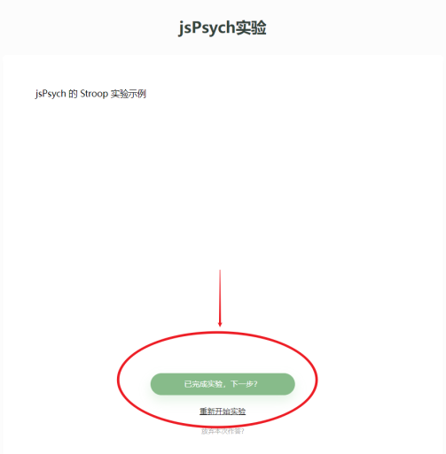
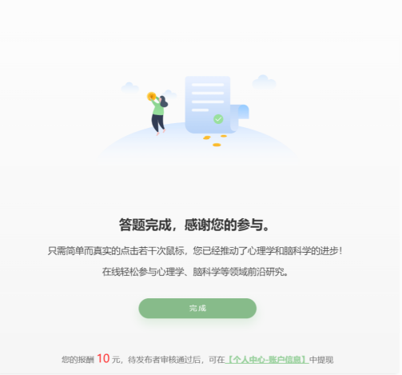

## 作答必读

当您作答时，可能会存在一个实验有多个部分（多个实验+问卷）的情况。

当您完成了单个实验（不是问卷，一般是一些需要作出反应的任务），并看到了实验的结束语时，请不要直接关闭浏览器，而应该仅关闭实验的标签页，回到上一个页面，点击「已完成实验」。如果有未完成的部分，则会进入下一部分；如果完成了所有部分，则会提交数据。

如果没有提交数据，研究者将无法正常收到您的作答，您也很可能因此得不到报酬。

